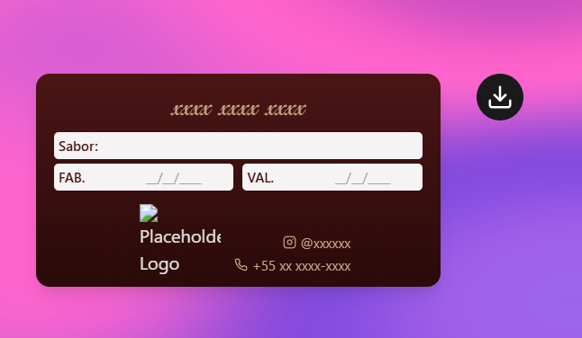

# card png generator


1. Clone the repository:
   ```
   git clone https://github.com/Gstxxx/card-png-generator.git
   ```

2. Navigate to the project directory:
   ```
   cd card-png-generator
   ```

3. Install the dependencies:
   ```
   npm install
   ```

4. Start the development server:
   ```
   npm run dev
   ```
   
## preview :


